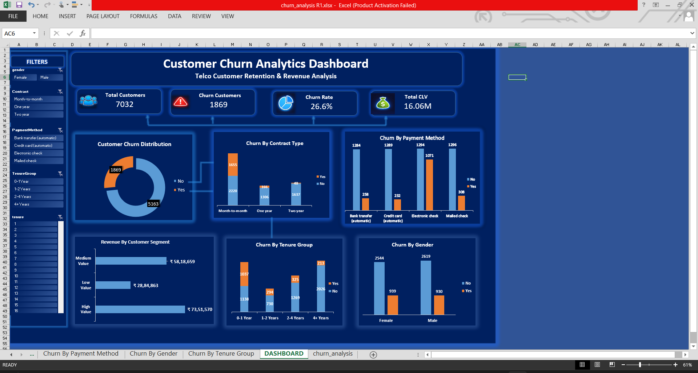

# 📊 Customer Churn Analysis

## 🔍 Project Overview
This project analyzes customer churn data to identify key factors affecting customer retention and business performance.

---

## 📁 Dataset
- Total Customers: 7032  
- Churn Customers: 1869  
- Churn Rate: 26.6%  

---

## ⚙️ Tools Used
- SQL (Data Analysis)
- Excel (Data Cleaning & Dashboard)

---

## 📊 Dashboard

---

## 📈 Key Insights
- High churn observed among **month-to-month contract customers**
- Customers with **0–1 year tenure** show higher churn
- Certain **payment methods** contribute to increased churn
- Overall churn rate is **26.6%**

---

## 💡 Recommendations
- Encourage long-term contracts to reduce churn  
- Focus retention strategies on new customers  
- Improve early-stage customer engagement  

---

## 🚀 Project Outcome
This project demonstrates the ability to analyze real-world data, build dashboards, and generate business insights.

---

## 🔗 Connect with Me
LinkedIn: https://www.linkedin.com/in/gnana-sekar-g-694b702a3/
